# Summary of Rainbow Store Customer Prediction

High-level outline for our analytic project:

__1. Problem Understanding__

__2. Methodology__

__3. Workflow Results__

__4. Answer on Discussion Problem__

__5. Next Steps__
    
Note: This report is the summary of the full project, which is available [here](https://github.com/hoducninh/rainbow-challenge). 

## Problem Understanding

In this notebook, we are going to help Rainbow to understand and predict customer behaviors. The entire assignment can be viewed [here](https://github.com/hoducninh/rainbow-challenge/blob/master/appendix-problem-uderstanding/VinIDRecruitChallenge_MLTrack_ProblemSet.pdf) and the one sentence summary is:

__Use the provided Rainbow store data to develop a model that can predict which customers make purchase in month 3, using transactional data from months 1 and 2, and then give recommendation on which customers for sending promotional e-mails to next month.__

In this project, we focus on the process of building a model which are: __labeling, feature engineering, modeling__ and __model interpretation__. Futher analysis may dive deep into the step of exploratory data analysis, baseline analysis and model optimization. 

## Methodology

After undertanding business problem, here is steps for our machine learning project: 

1. Data cleaning and formatting
2. Exploratory data analysis
3. Data labeling 
4. Feature engineering and selection
5. Build model and evaluate model on the testing set
6. Interpret the model results to the extent possible

### Data cleaning and formatting 

The provided csv file is in form of json format. To be easier to process data for analytic project, we would flatten the data using PowerBI data transformation tool. The PowerBI query code is provided [here](https://github.com/hoducninh/rainbow-challenge/blob/master/03-flatten-data/power-query.txt). 

The flattened dataset is quite good to go for exploratory data analysis. Some small steps such as: removing duplicates and checking missing values are taken. 

### Exploratory data analysis

Cohort analysis can be helpful when it comes to understanding your business’ health and "stickiness" - the loyalty of your customers. Remember a cohort is a group of users who share something in common, be it their sign-up date, first purchase month, birth date, acquisition channel, etc.

Cohort analysis can be helpful when it comes to understanding your business’ health and "stickiness" - the loyalty of your customers. For startups, it’s also a key indicator of product-market fit. We later discover the analysis results in the next parts.

### Data labeling 

This is important process since it affects the process of feature engineering later. For label the given dataset, we need to pay attention to the following points:

1. "__leaked labels__" - we do not use information from the future to predict a past event.
2. using __each customer__ as a label __multiple times__. 

To begin with, let's take a look at prediction process below:

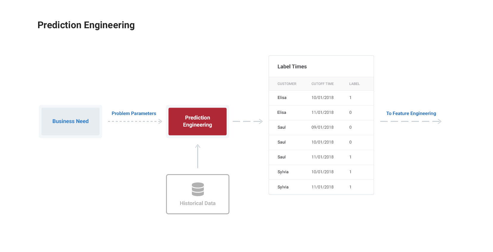

In order to prevent "leaked labels" and use each customer with multiple times, we need to understand the definition of __churn__.

### Definition of Churn: Prediction Problems

The definition of churn is __a customer does not make transaction in month 3 given any transaction information 2 months before.__ The time frame for making model feature vectors are shown below:

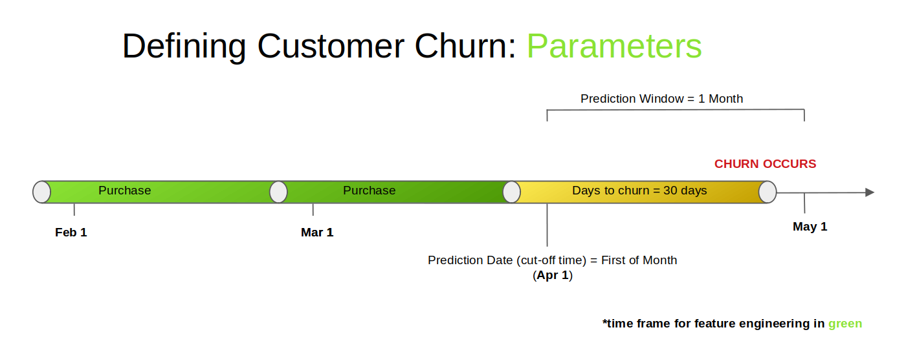

Instead of picking just a single month for predictions, we can use each customer as a label multiple times. In other words, we not only predict whether a given customer will spend in April, but we also ask the same question in May, June. The thing to note is that for each month, we can't use data from the future to predict the class of spending. Each month we can use information from maximum two previous months. Each label for a customer therefore has a different set of features because there is more or less data available to us depending on the month. 

#### Dataset

The transactions data consists of a number of variables, the most important of which are customer id (`customerid`), the date of transaction (`txn_date`), product code (`article`), sales quantity (`sale_quantity`), total price (`price`). Using these columns, we can find each churn for each customer and the corresponding date on which it occurred.

The transaction data is from 2018-02-01 to 2018-06-30. Base on our definition of customer churn, __we would not use new customer on May and June 2018__ in the modeling process. 

#### Churn Examples

We has some customers with their historical purchasing data as below:

```
(transaction_data, examining_month, is_churned)

customer Jon: ([2018-02-03, 2018-04-28], 2018-02, false)

customer Arya: ([2018-03-03, 2018-06-23], 2018-03, true)
```
Base on our churn definition, Jon was not a churned customer at Feb-2018 since he has transaction in April-2018. However, Arya and Sansa should be predicted as churned customer given their historical transactional data.

### Feature Engineering 

We will implement an automated feature engineering solution with [Featuretools](https://docs.featuretools.com/#minute-quick-start) for a set of Rainbow Store purchase data. The dataset is a series of time-stamped purchases and does not come with any labels, so we'll have to make our own prediction problem. After defining the problem, we can use automated feature engineering to build a set of features that are used for training a predictive model.

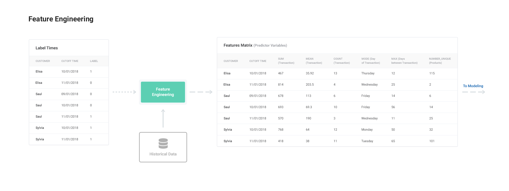

With the automated feature engineering approach using Featuretools, we didn't have to worry about using invalid data because the library takes care of the data filters for us using cutoff times. After passing the cutoff times to Featuretools, it automatically built features for us respecting the times filters. Remember, the cutoff time represents the point past which we can’t use any data for the label, and Featuretools automatically takes the time into account when building features.

### Build model and evaluate on test set

We jump to build the __XGBoost model__, which is normally praised for its prediction ability. A nice article about the model can be found [hear](https://towardsdatascience.com/https-medium-com-vishalmorde-xgboost-algorithm-long-she-may-rein-edd9f99be63d). 

We will see the dataset for prediction problems is quite balanced. So the AUC could be the good metric for model performance. A nice article about AUC can be found [hear](https://towardsdatascience.com/understanding-auc-roc-curve-68b2303cc9c5).

### Interpret the model results

Machine learning model interpretability have been discussing widely recently. In this project, we use some interpretability techniques on our model to suggest which customers to send promotional e-mails to next month.

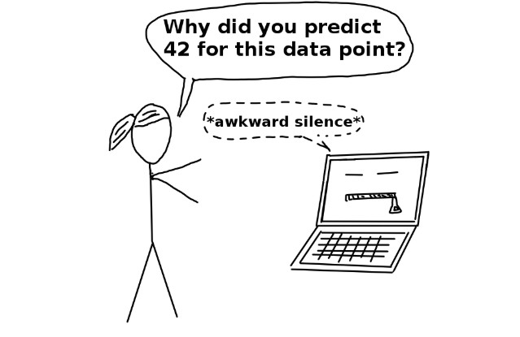

A very good book about model interpretation can be found [here](https://christophm.github.io/interpretable-ml-book/)

## Workflow Results

In this part, we will examine outputs from the above methodologies.

### Cohort Analysis

In our project, __a cohort is a group of user who have the first purchase month__. From cohort analysis, we would see some pattern in customer purchasing behavior and draw some suggestions for further business reviews.

In the following table, we will see the number of customer (`No of customer`) of different cohorts (`Join month`) and the percentage of retained customer through (`Month since joined`).

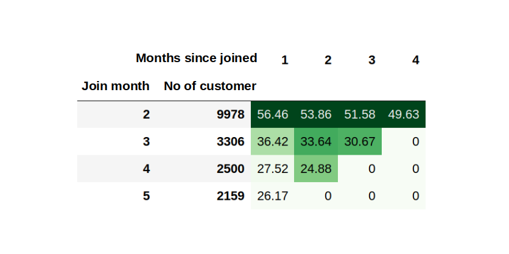

It is interesting that the number of customers who join in Feb-2018 is much higher than the following months. Number of new customers decreased more than 3 times, from 9978 customers in Feb to 3306 customers in March, and this number keeps dropping in the following months. 

We also see the retention rate drastically drops after one month of joining. Luckily, we maintain a stable retention rate in the following (`Months since joined`). It hightlights the point that, __customer onboarding is crucial for achieving the high retention rate__. A clearer wiew is presented in the following visualization.

 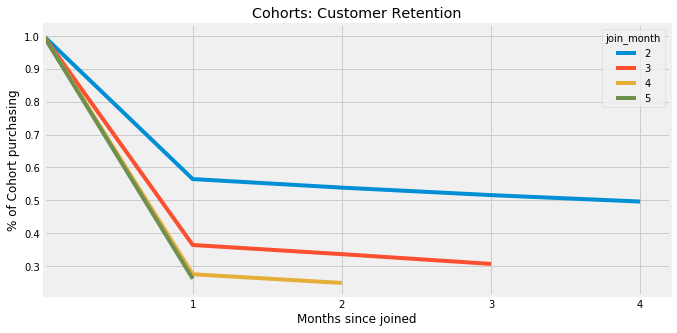
 
 From cohort analysis, some __business reviews__ need to be taken to clarify the following problems:

1. Why do we have many new customers in Feb, which is much higher than the following months?

2. Is any problem with customer onboarding, since the retention rate drop drastically after first month of first purchase?

3. Why is the retention rate maintain at the same level from the first to fourth month after the first purchase for each cohorts?

4. What are common characteristics of customers who remain active after first month of purchase? After answering this questions, should we develop __customer value proposition__ for this customer segment?

One suggestion for discussion problem: In the next month, we should send __the promotional emails__ for __new customers__ who have the first purchase. If everything goes on as usual, we could expect the high retention for our customer base. 

### Data Labeling, Feature Engineering and Selection 

In this part, we create a dataframe of labels - what we want to predict, and cutoff times - the point that all data must come before for predicting a label. Then use Featuretools to create the entityset to make features. The process could be seen as follow: 


#### Data Labeling

For data labeling, our approach is to create function to label on single customer on particular month based on the defined churn concept.

 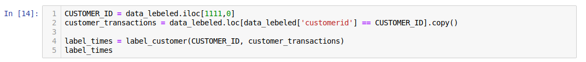

After testing successfully on single customer, we apply for all customers in our dataset. Now, we are good to move to the process of feature engineering and selection.

#### Feature Engineering 

The first step in Featuretools is to create an EntitySet which will hold all of our data and the relationships between the multiple tables. Initially we'll add the entire data as an entity to the set. Since data has a time_index, we'll add that and specify the variable type of the product description.

The time_index represents the first month the information in that row is known. When we build features, Featuretools will use this time_index to filter data based on the cutoff time of the label. We can't use any purchases from after the cutoff time of the label to make features for that label.

#### Feature Selection

At this point, we might want to apply some feature selection to our feature matrix dataset. It's likely that many of the features are highly correlated which can have a negative impact on model performance.

The following call removes:

1. Any features with more than 90% missing values
2. Any features with only a single unique value
3. One out of every pair of columns with a correlation greater than 0.9.

__From the process of feature engineering and selection, we obtain the modeling ready dataset, which containing 39 feature vectors__. For more details about the steps, the notebook can be found [here](https://github.com/hoducninh/rainbow-challenge/blob/master/02-notebook/notebook.ipynb).

### Build and evaluate model

From the dataset, we go directly to the modeling process using XGBoost. The process of __model optimization__ (tuning parameters, regularization) could be left for further projects in the future. 

 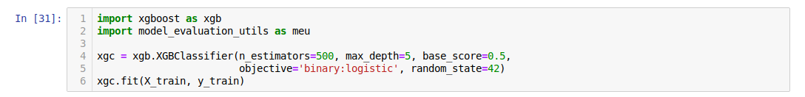
 
 After fitting the model, we use AUC as the metric to measure model performance on test set. The next figure plots the ROC curve.
 
 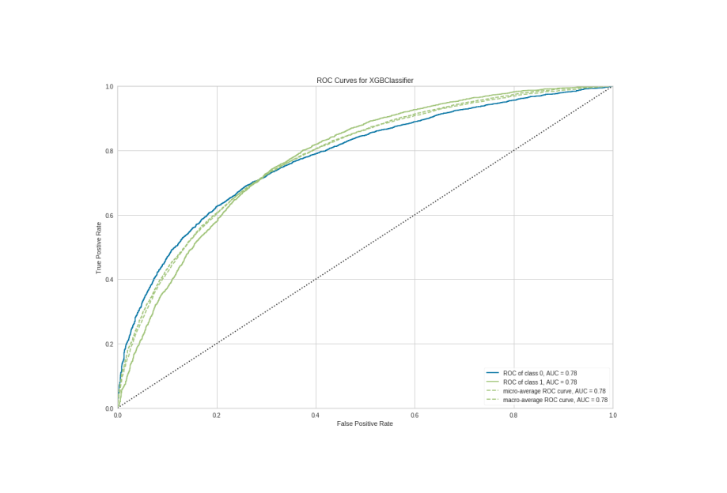

On the test set, we obtain AUC = 0.78 which is not bad in the first attempt. We could improve the results in future research. We move to the next part which is model interpretation.

### Model Interpretation with SHAP

__SHAP (SHapley Additive exPlanations)__ is a approach to explain the output by averaging all the marginal contributions to all possible coalitions (more detail available at [SHAP NIPS paper](http://papers.nips.cc/paper/7062-a-unified-approach-to-interpreting-model-predictions)).

In this part, we focus on the insight we gain from model which could pay the way for suggesting on which customers to send promotional e-mails to next month in the next section. 

We examine which factors that lead to churn behavior of customer in the following figure.

#### Feature Importances with SHAP

This basically takes the average of the SHAP value magnitudes across the dataset and plots it as a simple bar chart.

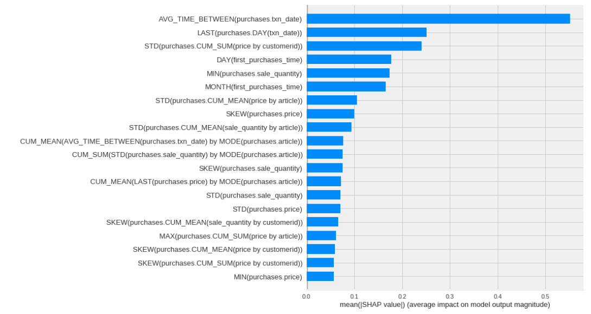

From the figure, the variable (`AVG_TIME_BETWEEN(purchases.txn_date)`) has the biggest impact on customer churn prediction. We will dive deep into two most important variables which are (`AVG_TIME_BETWEEN(purchases.txn_date)`) and (`LAST(purchases.DAY(txn_date))`)

#### SHAP Dependence Plots

SHAP dependence plots show the effect of a single (or two) feature across the whole dataset. They plot a feature's value vs. the SHAP value of that feature across many samples. The vertical dispersion of SHAP values at a single feature value is driven by interaction effects, and another feature can be chosen for coloring to highlight possible interactions.

##### PDP of 'AVG_TIME_BETWEEN(purchases.txn_date)' affecting model prediction 

Those customer having smaller average time between purchases are less likely to churn. 

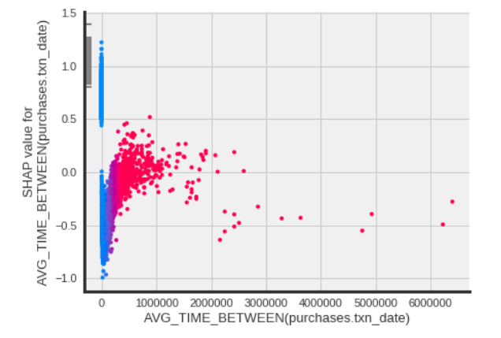


##### PDP of 'LAST(purchases.DAY(txn_date))' affecting model prediction 

Interestingly, customers who make purchase at the date (`15th`) and before are less likely to churn

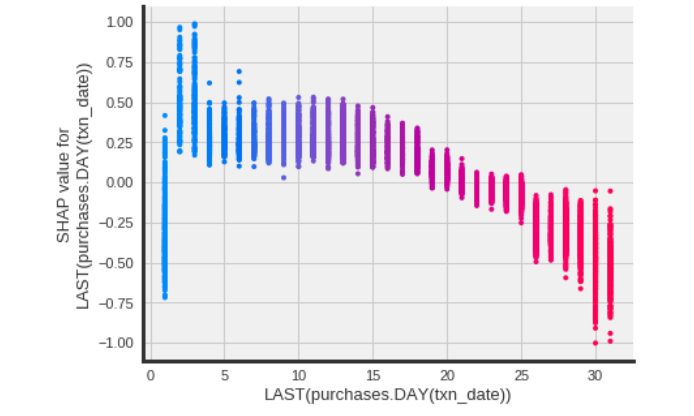

From the model interpretation with SHAP, we currently draw some conclusions:

1. Time difference between purchase and last purchase date in month are most important factors affecting customer churn prediction. 

2. Those customer having smaller average time between purchases are less likely to churn. 

3. Customers who make purchase at the date (`15th`) and before are less likely to churn.

## Answer on Discussion Problem

### Which are customers to send promotional e-mails to next month?

To answer the question, we will write a function to give prediction on monthly basis. The function allows us to pass in month in which we want to give prediction. This also ensures that when making predictions for one month, we're only using data from before than month.

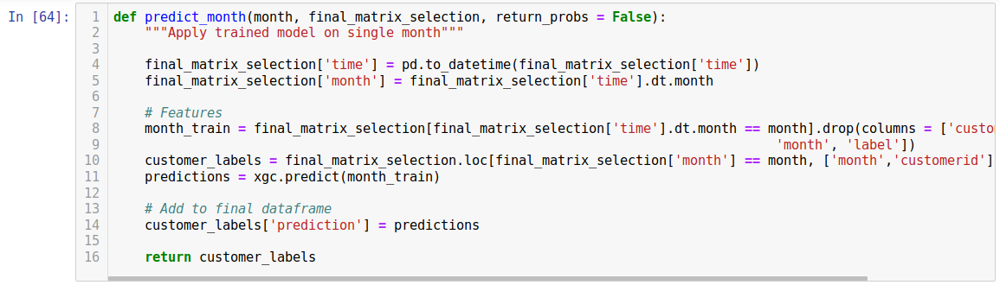

When testing on a particular month, it works!!!. Remember that, the (`label`) from above function is created from labeling process. The value would be (`NaN`) for new customer and customer with transaction in May and July - 2018.

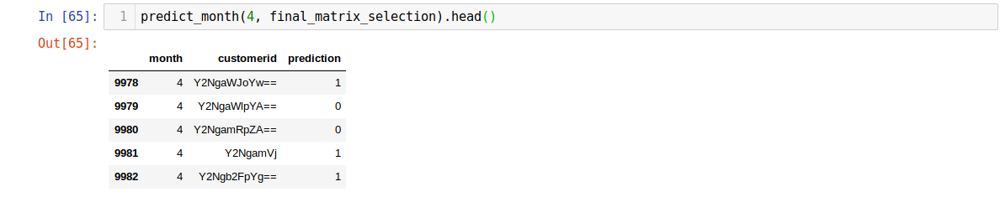

 __By doing this, we could import more data from coming months and give prediction on churn customers__.
 

Back to our question on which customer to send promotional emails, we got some points to remember so far:

1. Our __methodology for modeling process__ for our problem prediction in which, we only take into account those __customers who have more than 2 months of purchase__. 

2. From the __cohort analysis__, it suggests that we should __send emails for those customers having the first purchase in the same month__. From this, we hope the retention could be at high rate in the following months.

3. From model interpretation with SHAP, we could __send promotional emails for those customers who have after (`15th`) everymonth and has long time difference between purchases__.

So, __there is a conflict between the insights from exploratory analysis and our modeling methodology (which is pre-defined)__. There are some posible ways to deal with this:

1. __Change our approach__ for the __modeling methodologies__ (i.e.churn definition)

2. __Test and learn__ from both approaches to find __the best way__ to deal with churn customers.

### What problems do you see in applying the model in this way?

1. We found uncomfortable situation when results from cohort analysis has not applied into our model in the best way. 

2. We might change the approach for modeling process after the steps of exploratory data analysis. 

From this,the next steps is what we can adopt to improve the modeling process and business actions.

## Next Steps

From the our analytic project, it is good to recap some important findings in the views of business reviews and modeling process as follows.

### Business Actions

#### Business actions and review

1. Review business performance on customer onboarding (1 month after first purchase)
2. Explain abnormal number of new customers in February
3. Take into account which customers should be sent promotional emails in next months in part 4.

#### Modeling process:
1. Exploratory data analysis

  * Adding more exploratory data analysis because it should be helpfull in the following process of modeling.

2. Modeling process

  * Review how we define churn customer
  * Adopt model optimization process 

__Thank you for reading!!!__

Bests, 

##### hoducninh
